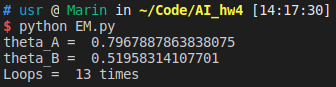
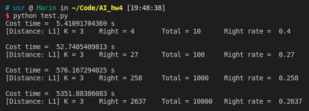
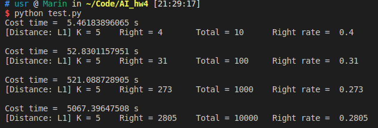
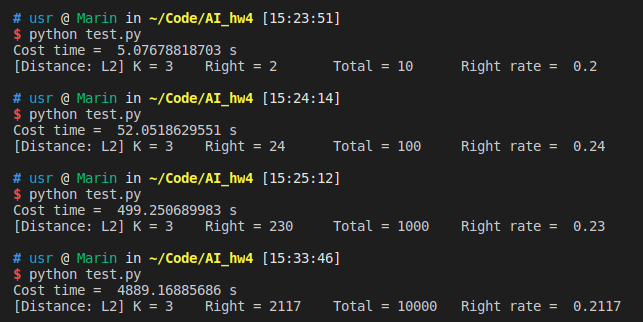
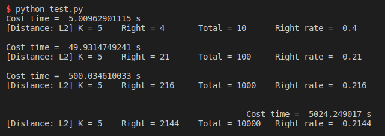
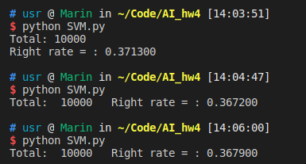
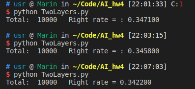

# AI Assignment4
- Name: Zhang Qi
- ID: 17343153
- Email: zhangq295@mail2.sysu.edu.cn

## 一、实验内容
1. EM算法双硬币模型
2. 对CIFAR-10数据集进行图片分类
    - [x] KNN
    - [x] SVM
    - [x] 双层神经网络

## 二、实验原理
### 1. EM算法
Expectation Maximization（EM，期望最大算法）是一种从不完全数据或有数据丢失的数据集（存在隐含变量）中求解概率模型参数的**最大似然估计方法**。


EM算法涉及到的基础知识及其详细推导过程可见[教程](https://zhuanlan.zhihu.com/p/35698329).

算法流程如下：
```
输入：
观察数据x = (x^1, x^2, ... ,x^m)
联合分布p(x, z|Θ)
条件分布p(z, x|Θ)
 极大迭代次数J

过程：
1. 初始化初始化模型参数Θ的初值Θ^0
2. for j from 1 to J:
    - E step: 计算联合分布的条件概率期望Q_i(z_i) := P(z^i|x^i,Θ)
    
    - M step: 极大化L(Θ),得到Θ:= arg( max Σ1…m(Σz^i (Q_i(z^i)logP(x^i,z^i|Θ))))
    
    - 重复E、M步骤直到Θ收敛

输出：
模型参数Θ
```

### 2. KNN
参考斯坦福[图片分类课件](http://cs231n.github.io/classification/).

### 3. SVM
参考斯坦福[线性分类器课件](http://cs231n.github.io/linear-classify/).

### 4. 双层神经网络
参考斯坦福[Softmax分类器&神经网络课件](http://cs231n.github.io/neural-networks-case-study/).

## 三、实验过程及结果
### 1. EM算法
按照上述EM算法的流程可以得知算法主要是对Θ_A和Θ_B进行迭代更新，所以在程序(`EM.py`)中除了相关变量的初始化以外，一共有两个函数：
```python
#  ִ执行一次EM过程并更新Θ_A和Θ_B
def EM_once(priors):
    pass

# 执行EM循环，误差小于阈值或循环次数大于一定次数后停止
def EM(prior, threshod = 1e-6, max_loops = 10000):
    pass
```
得到的实验结果如下：


### 2. KNN
Nearest Neighbor，顾名思义，就是找到“距离最近”的那张图片的label作为本图片的label。 而KNN则是在此基础上找到“距离最近”的N张图片进行投票，将得票数最高对应的label作为本图片的label。

所以本方法一共有两个影响结果的因素：距离、K

距离一般会有两种：L1距离和L2距离
- L1 Distance: d(I1, I2) = Σ|I1 - I2|
在程序(`KNN.py`)中对应：
```python
    # 计算L1距离，返回前K个最小距离的label
    def cal_L1(self, input_img):
        distances = []
        for i in range (0, len(self.imgs)):
            distances.append([np.sum(np.abs(input_img - self.imgs[i])), self.labels[i]])

        distances.sort(key = cmp)

        return distances[:self.k]  
```
- L2 Distance: d(I1, I2) = sqrt(Σ(I1- I2)^2)
在程序中对应:
```python
    # 计算L2距离，返回前K个最小距离的label
    def cal_L2(self, input_img):
        distances = []
        for i in range (0, len(self.imgs)):
            distances.append([np.sqrt(np.sum(np.square(input_img - self.imgs[i]))), self.labels[i]])

        distances.sort(key = cmp)

        return distances[:self.k]
```

至于K的取值，按照教程上说可以使用**交叉验证**的方法来求出最优解，但在程序中我没有实现，而是采用手动调参测出几组数据作为实验结果。

KNN的训练过程(`def train(self):`)就是训练样本（50000张图片）及其对应的Labels存起来。
KNN的预测过程（`def predict(self):`）就是将测试样本与训练样本逐个计算距离然后排序，选出距离最短的K个图片进行投票。

得到的实验结果如下：
- L1:
  - K = 3
    

  - K = 5
    
- L2:
  - K = 3
    

  - K = 5
    

### 3. SVM
程序中实现的是一个**线性分类器**SVM。
实现的流程大致如下：
-  对所有数据进行预处理： 求出训练集/测试集的像素值的均值，然后将所有图片的像素值减去该均值，最后将他们归一化到[-1,1]。程序中对应(`__main__`函数中的前半部分代码)
-  训练：(程序中对应`def train(self, X, y, learning_rate=1e-3, reg=1e-5, num_iters=100, batch_size=200):`)
   -  计算score function： f(x_i,W,b)=Wx_i+b 将每个图片xi与参数W,b作线性运算，得到一个(K*1)的得分矩阵，依次为该图片在该类图片上的得分。
   - 计算loss function:  L = data_loss + regularization loss = 1/N *∑i∑j≠yi[max(0,f(xi;W)j−f(xi;W)yi+Δ)]+λ∑k∑lW2_k,l 得到图片在该参数下的loss值。程序中对应`def loss_func(W, X, y, reg):`
   - 优化W: 通过对L求W的偏导dW来更新W: W_new = W_old - α × dW，其中α为学习率。（因为b为常数，所以此步骤无需优化）
- 预测（程序中对应`def predict(self, X):`）：
  - 计算测试集中每张图片对应的score function，列向量中最大值对应的类别为预测的类别。

实验结果如下：


### 4.双层神经网络
这部分我采用的Softmax算法.
**如果是单层模型**，其实与SVM大致相同，只不过Softmax是非线性的。
这个非线性主要体现在损失函数上：Li=−log(e_f_yi/∑j(e^f_j))

但是需要实现的是一个双层模型，所以需要在单层的基础上加一个隐藏层hidden_layer，大致等价于在单层上得到的score function，然后hidden_layer需要再进行一次score function（公式一样，参数不同）得到**最终的score**。
而对于参数的优化也还是利用偏导的方式进行，详情可见代码，此处不再赘述。

得到的实验结果为：


## 四、实验结果分析
- 准确率：SVM >= 双层Softmax > KNN

- 运行时间: SVM << 双层Softmax << KNN 

- 可信度：KNN的准确率应该可以**完全复现**，其他两者的结果可能会有些许偏差。这个**偏差主要来自于参数的初始化**——我是采用随机数生成的初始值，所以对于不同时间、不同设备上进行实验，初始值会有区别，导致后续对参数的优化程度不一致，所以实验结果可能会有偏差。

- 实验结果分析：
  - 首先KNN是三种算法中最“暴力”的算法，所以其运行效率低下。而且该方法在计算距离时收到图片像素的影响较大，可能同类别的图片之间的距离也会差别很大，所以准确率不高。
  - SVM则是三者中表现最好的一个算法，而且运行时间较快。这是因为经过训练的出来的结果是两个优化后的参数在预测过程中只需要将测试样本与这两个参数进行线性运算即可得到最终的结果。
  - 双层Softmax的准确率稍逊于SVM，但运行时间较长（而且是在迭代次数比SVM少个数量级的情况下还比SVM慢），这是因为其损失函数涉及到指数运算，而且对于每一轮迭代需要计算“两次score funcion”，而且涉及到的参数有四个（W, b, W2, b2），所以需要更多的时间。但是因为设备以及时间的限制，我并不能测试迭代次数更多的结果，所以姑且认为其准确率稍逊于SVM。
