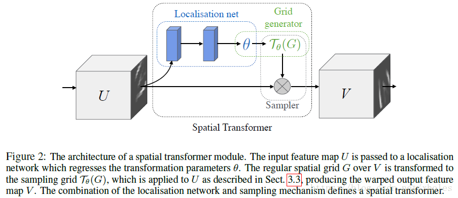

# Assignment5 - Report

- Name: Zhang Qi
- ID: 17343153
- Email: zhangq295@mail2.sysu.edu.cn

## 一、实验内容
1. 设计并实现CNN模型，对MINIST手写字符数据集进行分类。
2. 设计并实现CNN模型，对CIFAR-10图像数据集进行分类。

## 二、实验环境
- Ubuntu 18.04LST
- Python 3.6,.9
- Pytorch 1.3.1+cpu

## 三、实验过程及结果
###　1. MINIST手写数字分类
因为在**计算机视觉**这门课做过印刷体的数字识别，然后老师在课上提到过对于手写体的数字识别可以使用[Spatial Transformer Networks(STN)](https://zhuanlan.zhihu.com/p/37110107)来提高准确率，所以对于本次作业我使用STN+CNN来完成。

程序实现逻辑/流程：
  - 加载MINIST数据集
    在网上查阅相关资料时发现Pytorch有函数可以直接下载并加载MINIST数据集：`torch.utils.data.DataLoader(datasets.MNIST(）`。

  - 空间变换器(Spetial Transformers)
    如图，一个空间变换器可以分为三部分：
    

    (1) 本地网络是一个用来回归变换参数θ的网络，它的输入是特征图像，然后经过一系列的隐藏网络层输出空间变换参数。对于2D图像的MINIST数据集，需要实现仿射变换，θ 就是一个6维（2x3）向量的输出。
    (2) 网格生成器是依据预测的变换参数来构建一个采样网格，从而得到得到输出特征图的坐标点对应的输入特征图的坐标点的位置。
    (3) 采样器利用采样网格和输入的特征图同时作为输入产生输出，得到了特征图经过变换之后的结果。

  - 前向传播
    这个过程其实就是在CNN的前向传播中加入空间变换器，也即增添了一个上采样的过程，这个采样需要依靠一个特定的网格作为引导。
    程序中对应的函数为：
    `Model.__init__(self)` 和 `Model.forward(self, x)`

  - 反向传播
    采样器的求导：
    
    网格生成器的求导：
    
    然后使用随机梯度下降（SDG）的方法来不断优化参数。
    因为Pytorch提供了相应的函数`torch.optim.SGD()`，所以代码减少了很多，直接将其放到函数`train(epoch, train_times)`的循环中进行。

  - 训练、测试
    程序中对应的函数为`train(epoch, train_times)` 和 `test()`

对训练集训练了20次,准确率大概在98~99%，得到的结果如下：

### 2. CIFAR-10图像分类
这部分单纯采用CNN完成，没有结合其他算法。

程序实现逻辑/流程：
  - 加载CIFAR-10数据集
  跟MINIST一样，CIFAR-10作为一个很经典数据集在Pytorch中具有内置的函数可以直接下载并使用。
  - 创建卷积网络、前向传播：
  创建了五个卷积层，最后使用GAP连接输出层
  程序中对应的函数为：
  `Model.__init__(self)` 和 `forward(self, x)`
  - 训练、测试
    程序中对应的函数为`train(epoch, train_times)` 和 `test()`

对训练集训练了10次，准确率大概73%左右，实验结果截图如下：

相比Assignment4中的自己从0到两层卷积神经网络，准确率整整提高了一倍...一方面是层数的差距，不过使用Pytorch提供的函数来写代码的确“简单”很多——尽管自己还是有很多函数不会用/不认识。